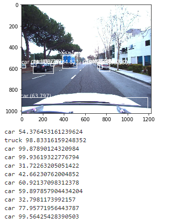

# Object-Detection-for-Autonomous-Vehicles-Based-on-YOLOv3
#### Implement simple object detection with Keras of some JPEG images in the training set. Using a pretrained (MSCOCO dataset) YOLOv3 model
#### Dataset: 
>Lyft 3D Object Detection for Autonomous Vehicles 
(https://www.kaggle.com/c/3d-object-detection-for-autonomous-vehicles/data)

#### Referance: 
>[1]https://machinelearningmastery.com/how-to-perform-object-detection-with-yolov3-in-keras/
  
#### Structure:  
>  
>    
>    
 
#### Result:  
>  
>  
>  
